# PIL
## Копирование и вставка областей

## Рисование точек и прямых линий
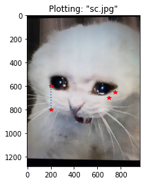
## Визуализация изолинии
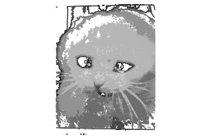
## Гистограмма в Matplotlib
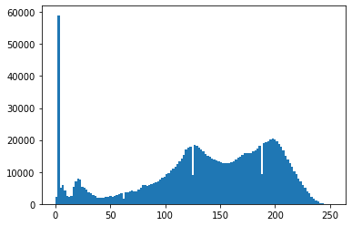
## Инвертированное изображение
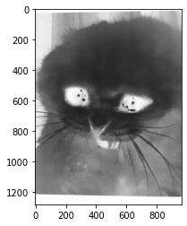
## Изображение в ограниченном диапазоне
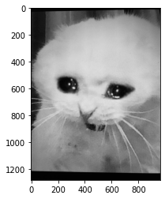
## Квадратичное преобразование изображения
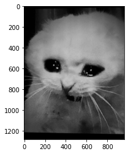
## Изображение с выравненной гистограммой
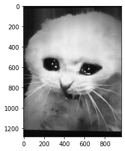
## Метод главных компонент(PSA), левое верхнее изображение - среднее
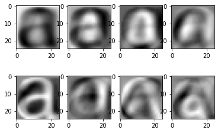
## Фильтр Гаусса (сигма=8)

## Производное изображение с помощью оператора Собеля (по х)
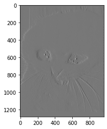
## Производное изображение с помощью оператора Собеля (по у)
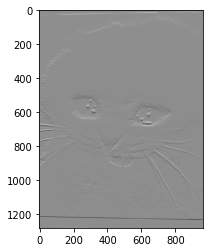
## Модуль градиента
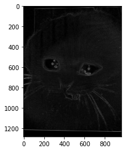
## Производное изображение с помощью фильтра Гаусса (по х)
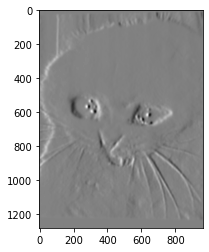
## Производное изображение с помощью фильтра Гаусса (по у)
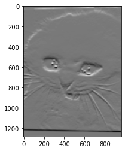
## Бинарное изображение
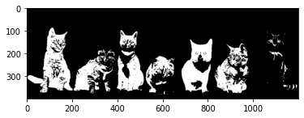
## Операция бинарного закрытия
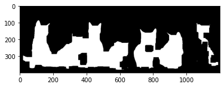
## Исходное зашумленное изображение

## Изображение после гауссова размытия (сигма=10)

## Изображение после очистки шумов
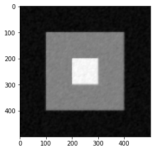
## Еще одно изображение после очистки шумов
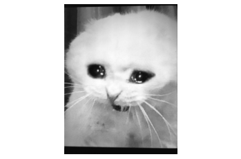